Welcome to the age of ExpressLRS! There are some incredibly small ExpressLRS radio receivers available on the market, but they are designed to communicate with a drone's flight-controller so they only have two data pins, one TX and one RX. This makes it difficult to be used with devices that use PWM signalling, such as servos and ESCs.

There is a way to convert these tiny receivers to having three PWM outputs! This is great if you are building a robot or car or a V-tail. Here's how to do it:

I do recommend this particular receiver for combat robotics, the BetaFPV ELRS Lite, with the flat antenna.

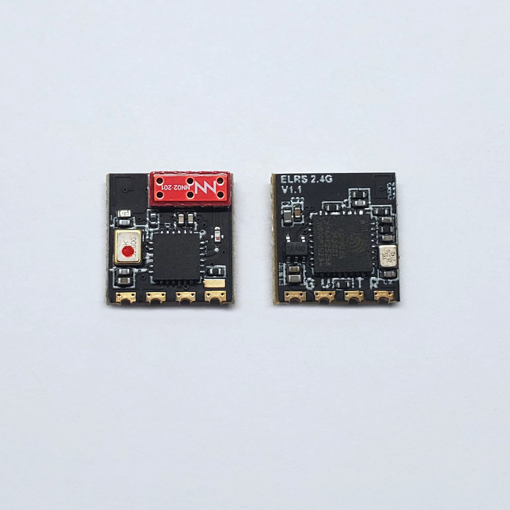

The flat antenna seems like a safer option than the cubic ceramic antenna in an impact situation. The other reason is that the "boot" pad on it is rather large, so it is easier to solder. If the receiver has no "boot" pad, then you cannot add the 3rd channel to it.

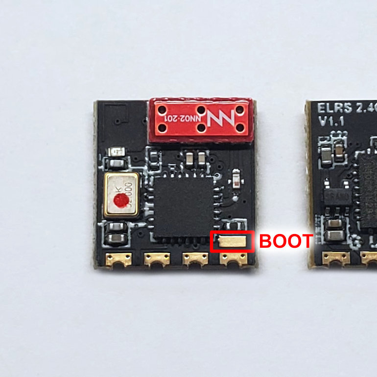

The first step is to get a piece of male header pins, 5 pins, 0.1" standard spacing. Trim four out of the five pins so that it can be soldered to the receiver as close as possible. The 5th pin should still stick out, which will make it easier for you to connect with the boot pad.

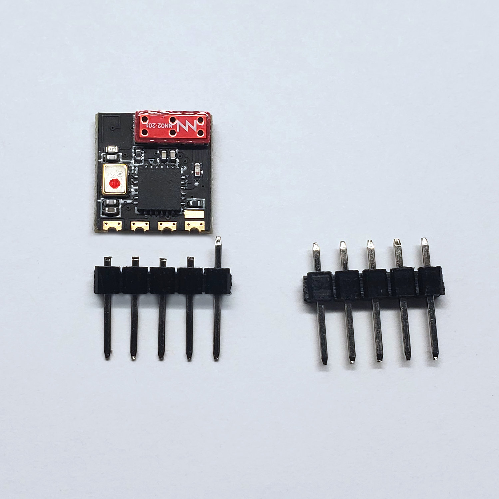

Solder one of the pins to the receiver. Make sure all of the pins are aligned. (if they are not aligned, then melt the solder and adjust the alignment)

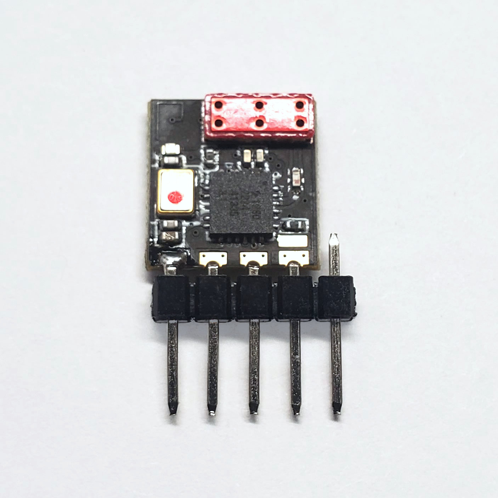

Solder all four pins, make sure that each joint is strong (also solder the back side). Tin the boot pad and the 5th pin in preperation for the wire.

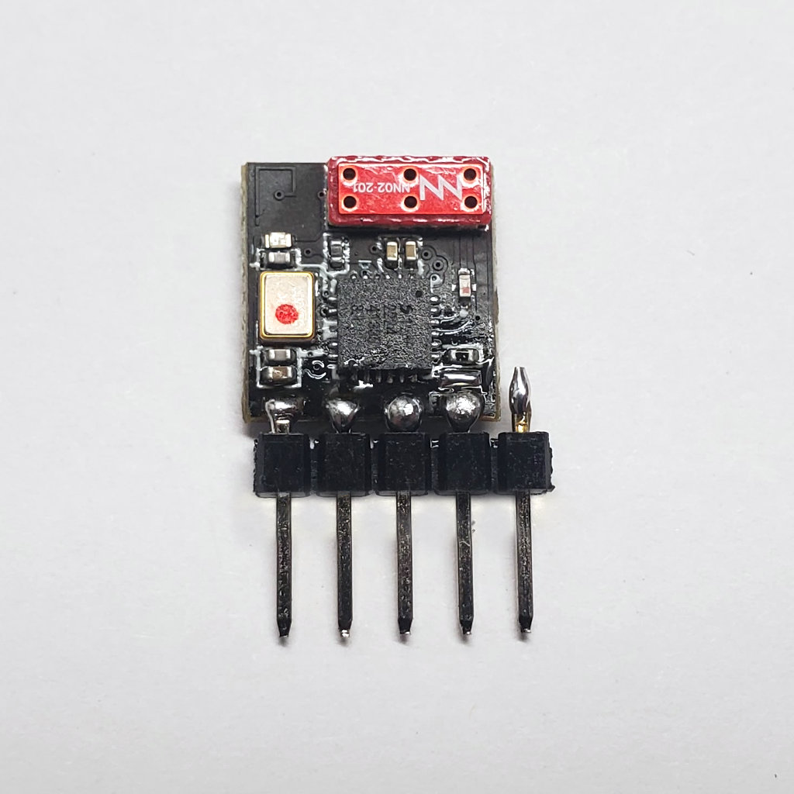

Solder a thin wire from the boot pad to the 5th pin. (I used 30 AWG wire)

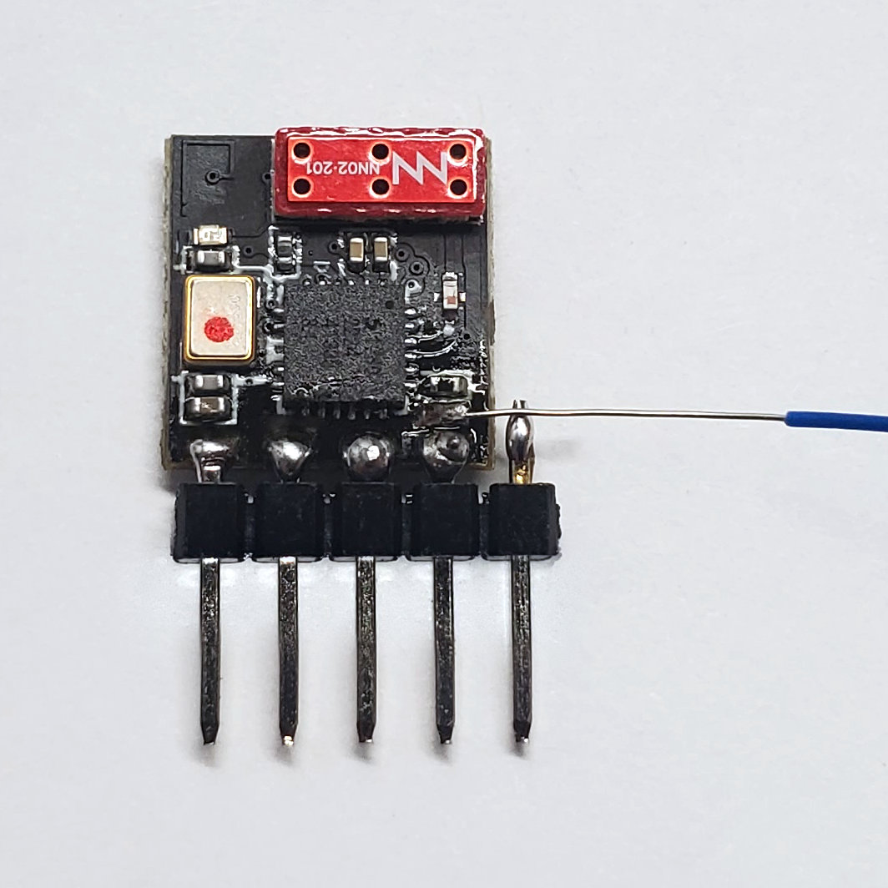

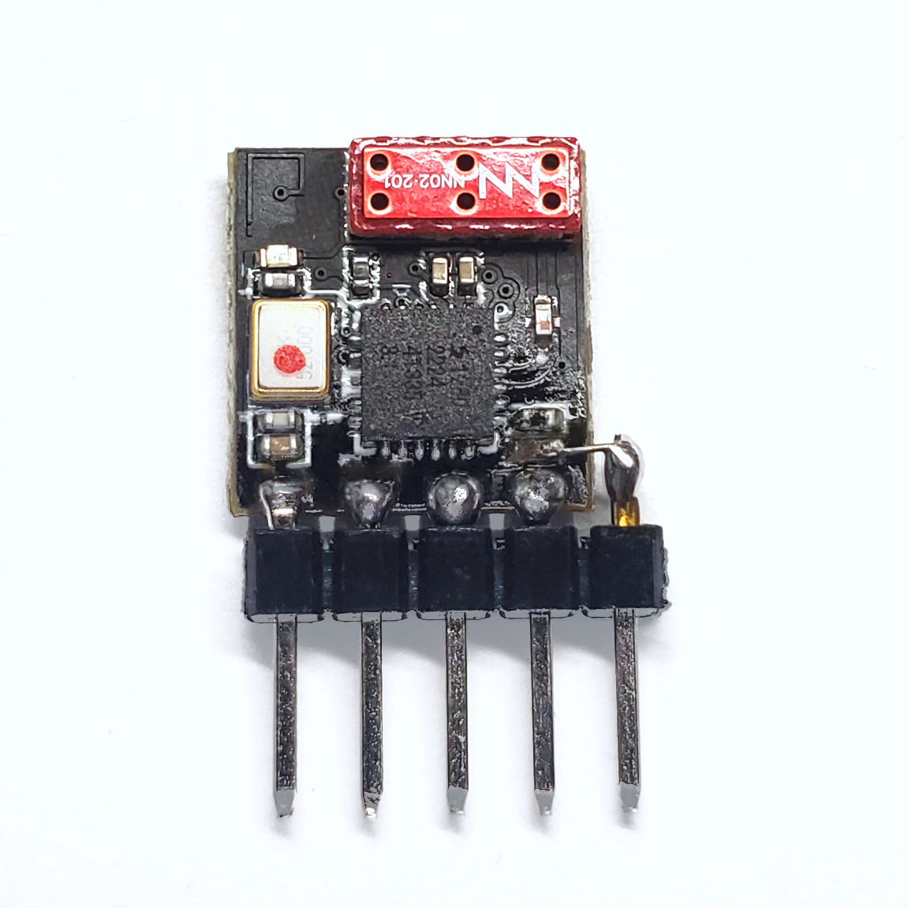

Trim off the excess wire and you are done soldering! Clean the flux off if required. Apply the heat-shrink.

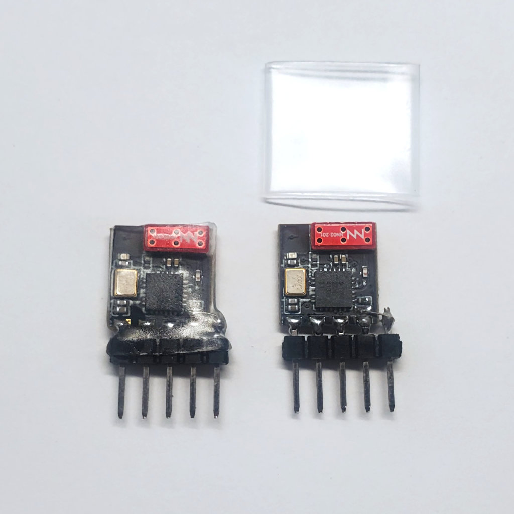

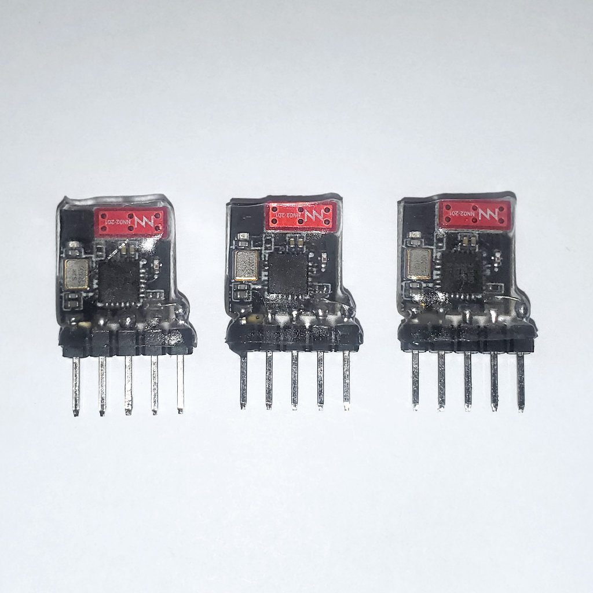

Now to configure the ELRS receiver to output PWM signals. Follow this diagram, power up the receiver by connecting the V+ and GND pins to a BEC (or any 5V power supply).

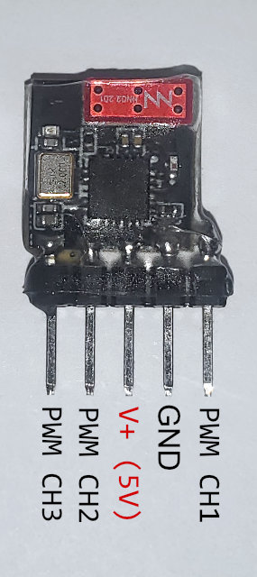

Once the receiver is powered ON, wait for 60 seconds until the Wi-Fi interface starts. Connect to the access point named `ExpressLRS RX`, with the password `expresslrs`. There will be no internet available through this access point and your smartphone or computer will need to be told to not disconnect from it.

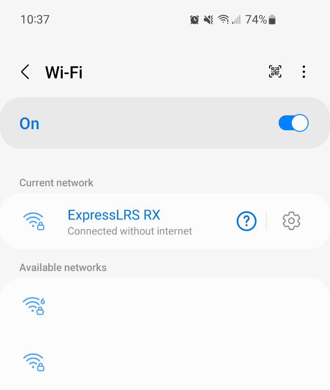

Once connected to the Wi-Fi access point, open up a browser and use it to navigate to `http://10.0.0.1/hardware.html`. From there, you can upload a new hardware configuration JSON file, please use the one I [provided for you here](pwm3.json).

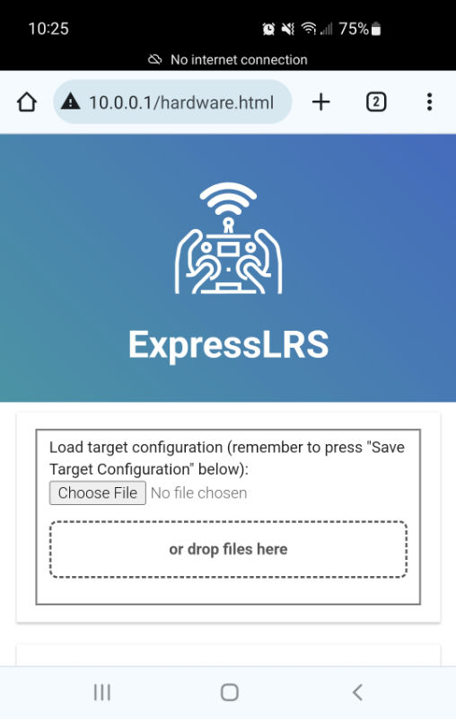

After that, configure the receiver however you like, such as setting the binding phrase. Please pay special attention to the failsafe configuration for safety reasons.

Here it is compared against other small receivers:

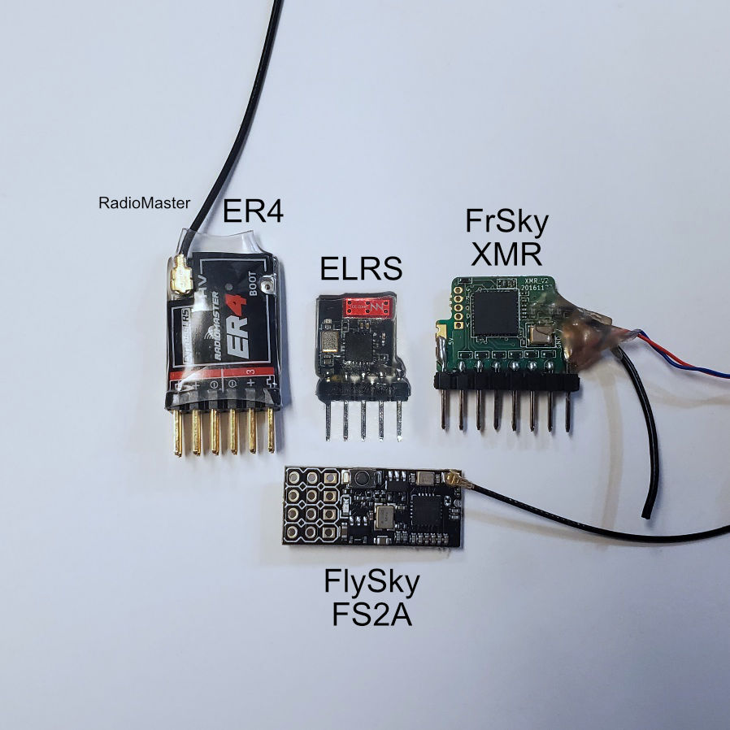

If you need some super short connectors to connect to this super small receiver, [please consider this technique](../Make-Short-Dupont-Plug-Connectors/readme.md).

