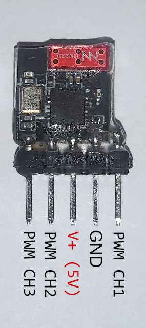
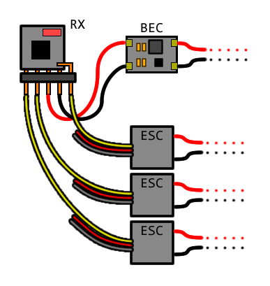
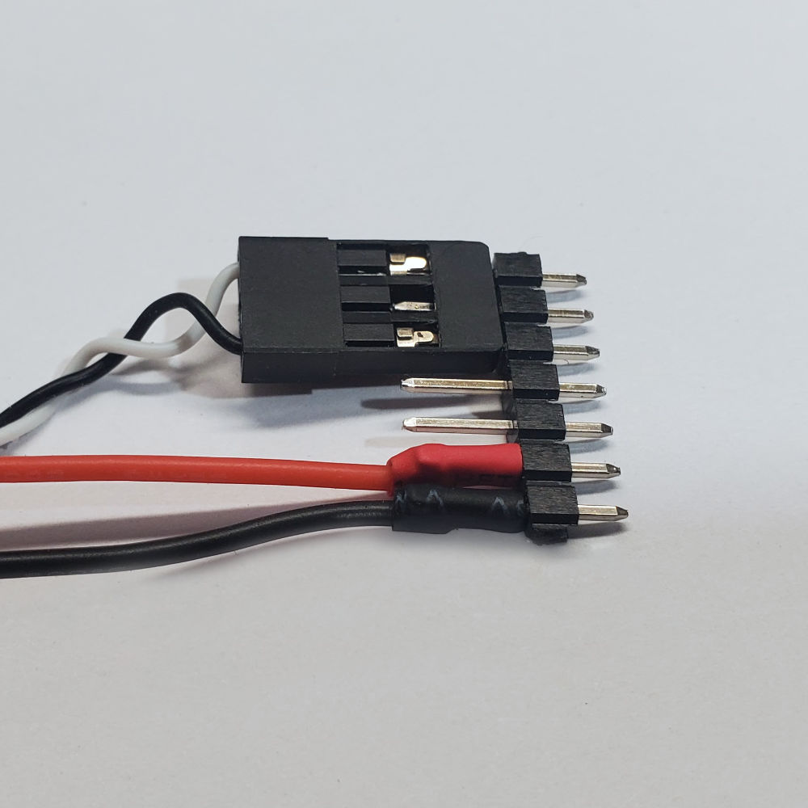
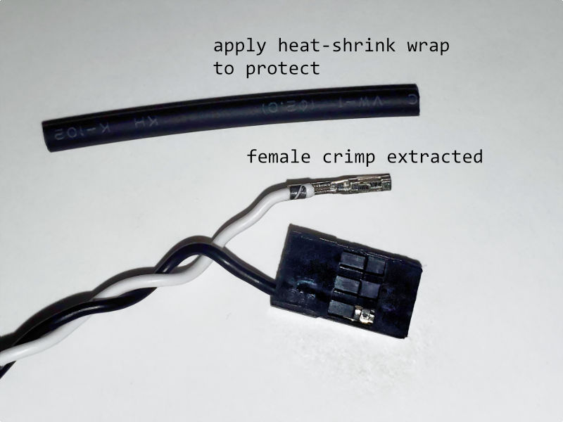

# Usage with Combat Robots

Here's the pin assignment after completing the modification:

Notice that there is only one ground pin and one power pin. This is really different from other larger RC receivers where there are multiple ground pins and multiple power pins. Not all of the ground wires need to be connected, and as long as one ground is connected to the receiver, and the receiver is supplied from just one 5V power wire, then it will work.

## Power Connection Examples

The most simple way to power the receiver is to use a BEC. BEC are "battery eliminator circuits", they are DC-DC buck converters, regulating the voltage from a high voltage down to a 5V output. (their name comes from how they eliminate the need to include a secondary low voltage battery)

Some ESCs will have a built-in BEC. In these cases, the ESC usually has a typical 3-wire cable. The red wire is 5V, the black wire is ground, and the signal wire is some other color (white or brown or yellow).

(the signal wires in the above diagrams are not connected, later examples will show how signal wires can be connected)

## Signal Connection Examples

Here's an example of how to wire up three ESCs when a BEC is also being used:

The key here is that even though each ESC might have a 3-wire cable, only one of those 3 wires are connected to the receiver.

Here's an example for when a dual-ESC is being used:

Here are two examples of how to wire up a servo:

IMPORTANT: you can swap the channels around if a certain arrangement works better

IMPORTANT: you can swap the channels from within your radio as well, by either modifying your mixers, or by remapping from the channel output configuration

## Modifying Connectors

If you need some super short connectors to connect to this super small receiver, [please consider this technique for making small connectors](../Make-Short-Dupont-Plug-Connectors/readme.md).

The above method is OPTIONAL. You can plug into the receiver without doing soldering, with some of the following techniques below.

You can plug in standard servo connectors "sideways", like so:

You can also pull out the female crimp from a servo connector, by using a screwdriver (or a knife blade, or tweezers) to pry up the locking tab, and then simply pulling out the crimp:

