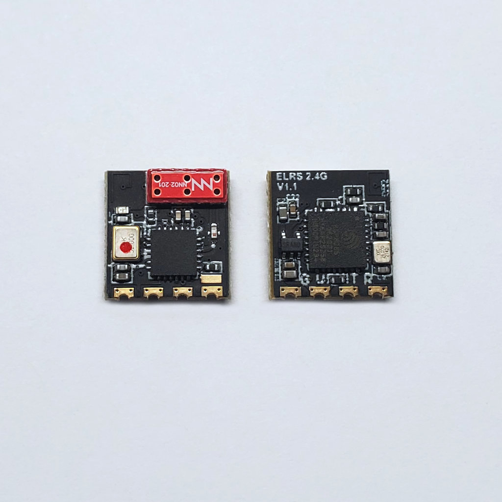

If you think standard servo plugs are a bit too long, I have a simple and easy technique for making much shorter dupont female connectors.

Have a look at the original servo connector, the internal crimp of the servo connector, and compare that against the length of the standard male header pin.

The servo connector is clearly twice as long as the male header pins.

Making the shorter version is easy. Simply cut the crimp to be the same length as the male pin, discard the tail. Then solder the wire to the back side of the crimp.

When soldering, make sure you don't get any solder inside of the crimp, do not let the solder leak into the seams.

Use a small bit of heat-shrink tubing to protect the wire and the crimp.

You are finished.

I recommend using 28AWG wire for this, or even 30AWG wire, as long as the wire is stranded-core. Also, using silicone jacketed wire will make this much easier.

I only recommend this technique to be used for PWM signal wires, and low power wires (such as simply powering a radio receiver). To save space in a space constrained situation, please also see [this technique converting ELRS receivers to use PWM](../ELRS-receiver-PWM-modification/readme.md).

