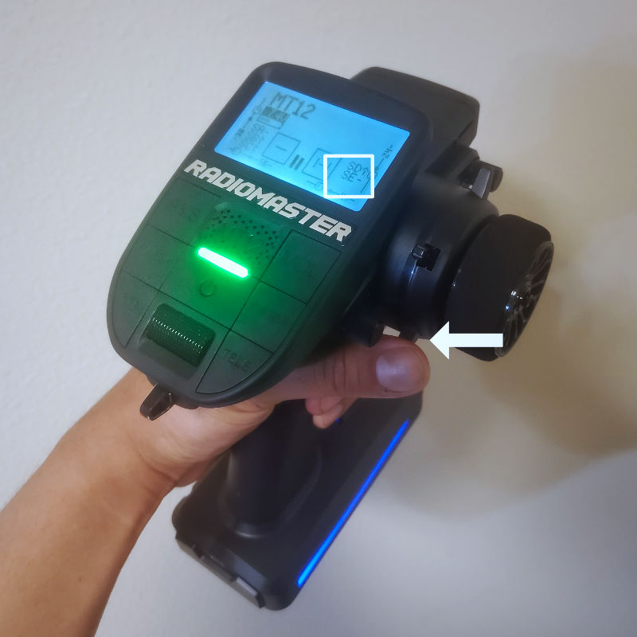

The RadioMaster MT12 surface radio originally has 5 trim switches and 4 switches.

Trim #4 is positioned right at where the user's thumb is. I think it would be nice if this trim switch can be used as a traditional momentary switch.

I made a modified firmware for the MT12 to turn trim #4 into **switch-E**. Please [download the file here](MT12-edgetx.2.10.0-extrathumbswitch.bin), and use the bootloader to apply the firmware.

This firmware is based on EdgeTX version 2.10.0, which is the same version that the MT12 shipped with. The code changes I made is minimal, please see the [diff file here](diff.txt).

NOTE: I advise that you map this switch also to a logical switch if you need to use the EdgeTX Companion App, as the companion app is not aware of this kind of customization.