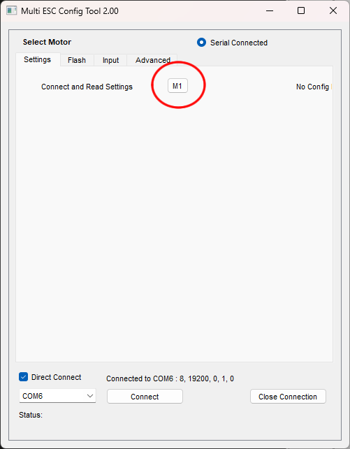

# What is CRSF and why it's better

CRSF is a communication protocol designed for remotely controlled racing drones. It is a replacement for the traditional RC PWM pulses.

Traditional RC PWM signals convey their data with the length of their electrical pulses. The problems with this:

 * this signal is actually considered analog, if a device wants to send a 1.22, the reader might measure a 1.23 instead
 * there's no official way of indicating if a pulse is real or not, noise can be interpreted as a pulse
 * inexpesive timing devices in electronics are affected by temperature, so a hot device measuring a pulse will yield the wrong result

For my fellow combat robot builders, you may have seen these problems occur when a weapon motor twitches unexpectedly when it is supposed to be off, or sometimes it seems like you need to adjust your radio trim after your robot gets hot, the robot might not arm or might even move without being told to.

CRSF is a digital serial bus protocol. It means the data is converted into digital ones and zeros, and those ones and zeros are sent in a sequence. This means sending a 123 will never result in the reader getting a 124.

There is also a checksum that can be used to ensure that if a packet is affected by noise, a 1 was misinterpreted as a 0, then the whole message received is considered invalid. One invalid packet is not a problem because the next one is still likely to be valid, and the radios using CRSF can send up to 1000 packets per second. (traditional RC PWM is usually 50 pulses per second)

This makes CRSF much safer, as there is zero chance that electrical noise or interference can cause a motor to go haywire.

CRSF packets are short, and there's idle time in between, if noise is very large during the idle time, it doesn't actually cause any miscommunication. Noise will appear as invalid packets, and never appear as valid.

I want to be clear: CRSF is not somehow immune to noise. If the noise is strong enough that literally every packet is invalid, then nothing will work. You should still use capacitors and shielding appropriately to filter and suppress noise.

The other advantage is that CRSF can use one wire to control multiple devices. CRSF packets contain 16 channels worth of data. If a CRSF-capable ESC can control two motors, it still only needs one signal wire to receive 2 channels.

What makes it a bit harder to use is that now every device you want to control with CRSF must be configurable. Each device must be configured to listen to a particular channel within the CRSF packet. 

# Configuring the ELRS Receiver

These instructions pretain only to the "nano" or "lite" sized receivers.

First start by activating Wi-Fi mode. Assuming you didn't previously disable Wi-Fi, Wi-Fi mode will automatically activate if the receiver doesn't connect to a transmitter. Otherwise, you will need to use your transmitter to active Wi-Fi mode. Then, you need to connect to the receiver over Wi-Fi. More detailed instructions about this from the offical ELRS documentation: https://www.expresslrs.org/quick-start/webui/#receivers (scroll down to where it says "How to get to the Web UI"

The main page of the ELRS configration webpage is at `http://10.0.0.1/`, but now we need to access the hardware configuration page, which is at `http://10.0.0.1/hardware.html`. On this page. Make three changes:

 * Set the CRSF Serial `RX pin` to `     ` **(blank)**
 * Set the CRSF Serial `TX pin` to `1`
 * Set the `PWM output pins` to `0,3`

Save the new configuration

This configuration gives you the option of using a few PWM devices along with a CRSF output. To correctly use the PWM outputs, you do need to configure each output, map them to the correct channel and assign a failsafe behavior. This configuration page is access through `http://10.0.0.1/`

Note: this tutorial assumes you have ELRS version 3.4 or later. Please perform a firmware update if you need to.

# ESCs with CRSF

Any ESC with AM32 firmware will support CRSF, but will require a firmware update. BLHeli32 and BLHeli_S do not support CRSF. BLHeli32 ESCs can be upgraded to AM32.

The currently official versions of AM32 does not have CRSF support, but they can be easily updated with the experimental firmware that does support CRSF.

# Updating AM32

**NOTE** these instructions are written when AM32 firmware version 3 is still in an experimental phase. When it exits the experimental phase, the instructions and URL links might change.

Visit https://github.com/AlkaMotors/Am32-Experimental

Download the configuration tool and then visit the `Releases` page.

From the `Releases` page, download the `.hex` file appropriate for your ESC. (you might need to ask somebody which file matches your ESC)

You will need a USB-linker tool to configure the ESC (please install the required drivers from whoever you purchased it from)

Connect the ESC to the USB-linker first, do not have power to the ESC, plug in the USB-linker to your computer

Only after everything is connected, power up your ESC (plug in the battery as the very last step)

Run the configurator. Check the `Direct Connect` checkbox. Select the appropriate `COM#` port from the dropdown. Then click `Connect`.

Attempt to communicate the the ESC by pressing the `M1` button, it will ask you to update the firmware when it realizes that the firmware is old.

Remember the `.hex` file you downloaded. Use the `Flash` tab on top of the config window. Press the `Load Firmware` button. Then select your `.hex` file. Then click `Flash Firmware`

The progress bar will start to go. You might see some flashing lights on your USB-linker. Wait for it to finish.

After it finishes, go to the `Settings` tab. Then click on the `M1` button again. Then you will see a `Signal Type` selection. Select `CRSF Serial` from the dropdown. Then in the next dropdown, select the CRSF input channel you want this ESC to use.

**SUPER IMPORTANT** This tool displays the channel number as *zero-indexed*. Most radios (and human beings) use *one-indexed* convention. So channel-0 in the AM32 config tool really means channel-1 on your radio.

Do any other edits you wish. Save the configuration.

Disconnect everything.

# Wiring to ELRS Receiver to AM32 ESC

You need to know if your ESC has a telemetry pin. Sometimes there's a pin labelled `T` or `TX` or `TEL` or `TE` on your ESC.

The small ELRS receivers have 4 pins, they should be labelled. These pins are generally:

 * Ground `G`
 * Voltage Input `V`
 * Transmit (TX) `T`
 * Receive (RX) `R`

The CRSF data needs the `T` pin. Connect between the ELRS receiver and the ESC like so:

There will be some ESCs that do not have a telemetry pin. Check with the AM32 community members to see if that particular ESC supports CRSF. For example, the Repeat Robotics Dual Brushless ESC certainly supports CRSF on the main signal input. So wire it up like this:

Remember that one CRSF signal can control as many ESCs as you want. It will look something like:

You will need to get a bit creative with the wiring. Although it might be tempting to just "jump" two close by pins together, doing so makes it harder to re-configure the ESC in the future. You can try that, but only if you are 100% sure you've finished configuring it.

NOTE: this might sound weird that you are connecting a transmit pin to another transmit pin. The reason is that AM32's firmware converts the telemetry pin into a secondary input instead under this configuration. But! This means for best electrical safety, you need to do the configuration before making the connection, also, it is impossible to get telemetry from the ESC when it is using CRSF.
